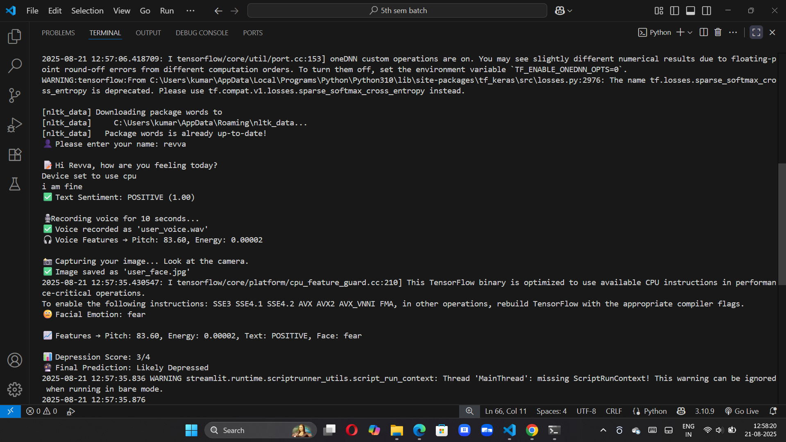

# 🧠 Depression Detection System

This project is an AI-powered system that analyzes **voice, text, and facial expressions** to provide a depression likelihood score.  
It is designed as a **proof-of-concept** for early detection support, not a replacement for medical advice.  

---

## 🚀 Features
- 📄 **Text Sentiment Analysis** using DistilBERT (NLP model)  
- 🎙️ **Voice Feature Extraction** (pitch & energy with Librosa)  
- 😐 **Facial Emotion Detection** using DeepFace  
- 📊 **Fusion Scoring System** combining all modalities  
- 💾 **Logs & History** saved in CSV format  
- 🌐 **Streamlit GUI** for interactive use  

---

## 📂 Project Structure


---

## ⚙️ Tech Stack
- **Python**  
- **Streamlit**  
- **Transformers (HuggingFace)**  
- **DeepFace (OpenCV backend)**  
- **Librosa**  
- **Pandas / Numpy**  

---

  
## 🖥️ Demo (Screenshots)




---

## 📊 Output Example
| Timestamp           | Name  | Pitch | Energy  | Text Sentiment | Facial Emotion | Score | Result            |
|---------------------|-------|-------|---------|----------------|----------------|-------|-------------------|
| 2025-09-13 20:14:11 | John  | 124.5 | 0.0182  | NEGATIVE       | sad            | 3     | Likely Depressed  |

---

## 🔧 Installation
1. Clone the repo:
   ```bash
   git clone https://github.com/Prince-git-hub-360/depression-detection.git
   cd depression-detection

